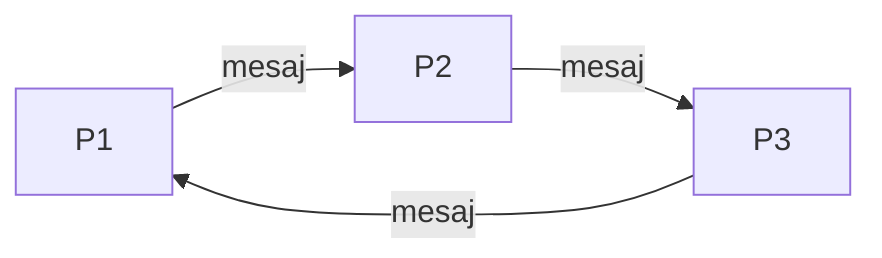

# Cum funcționează și cum prezinți cele cinci teme

Acest ghid explică implementarea din repository și cele cinci cerințe din
[lista laboratorului](https://cti.ubm.ro/tpi/2026/laboratoare/02-sockets/todo.txt).
Exercițiile folosesc Python, biblioteca standard `socket` și TCP.

## Pregătirea demonstrației

Deschide un terminal în folderul proiectului, unde există `demo.py`, `comun/` și
cele cinci foldere `tema...`. Toate comenzile din ghid se rulează de acolo.

Pentru prezentare, rulează fiecare exercițiu separat și explică rezultatul:

```bash
python3 demo.py 1
python3 demo.py 2
python3 demo.py 3
python3 demo.py 4
python3 demo.py 5
```

`demo.py` pornește programele exercițiilor în procese Python separate. Funcțiile
din `comun/lansare.py` folosesc `subprocess` pentru această pornire, aleg porturi
locale disponibile și așteaptă ca serverele să afișeze `PREGATIT`.

În fiecare rulare apare un folder nou în `rezultate/`. Calea exactă este afișată
după `TEMA N: OK. Rezultate:`. Deschide acel folder pentru a arăta fișierele
produse. Porturile din demo pot diferi de porturile fixe din comenzile manuale.

Mesajele sunt afișate grupat pe proces, după terminarea lui. Poți vedea ieșirea
clientului înaintea mesajului `PREGATIT` al serverului, deși serverul a fost
pornit primul.

Numerele de procese de mai jos se referă la participanții la exercițiu. Programul
`demo.py` este și el un proces, care se ocupă de pornirea și verificarea lor.

## Noțiunile de bază

| Noțiune | Ce înseamnă în proiect |
| --- | --- |
| Program | Codul salvat în fișiere Python. |
| Proces | Un program aflat în execuție. Trei porniri ale aceluiași program creează trei procese. |
| Client | Procesul care inițiază conexiunea TCP. |
| Server | Procesul care ascultă și acceptă conexiunea. |
| Socket | Capătul de comunicare prin care programul schimbă octeți. |
| IP | Adresa calculatorului la care se face conexiunea. |
| Port | Numărul serviciului de pe acel calculator. |
| `127.0.0.1` | Adresa propriului calculator, folosită pentru demonstrația locală. |
| Nod | Un calculator din rețea. În demo, procesele receptor rulează pe același laptop. |
| Timestamp | Data și ora asociate unui eveniment din log. |
| SHA-256 | Amprenta calculată din conținut, folosită la verificarea integrității. |

Clientul poate și primi date, iar serverul poate și trimite. Denumirile indică
cine inițiază și cine acceptă conexiunea.

În toate demonstrațiile locale, adresa IP este aceeași, dar serverele folosesc
porturi diferite. Pentru calculatoare distincte, folosești IP-urile reale și
pornești serverele cu `--host 0.0.0.0`, conform
[ghidului pentru rețea](noduri_retea.md).

## Codul comun de comunicare

Fișierul [comun/retea.py](../comun/retea.py) conține funcțiile folosite de teme.

| Instrucțiune sau funcție | Rol |
| --- | --- |
| `socket.socket(socket.AF_INET, socket.SOCK_STREAM)` | Creează un socket TCP IPv4. |
| `bind((host, port))` | Asociază socketul de ascultare cu adresa și portul serverului. |
| `listen(5)` | Pregătește ascultarea; numărul privește conexiunile aflate în așteptare. |
| `accept()` | Acceptă un client și întoarce socketul conexiunii și adresa lui. |
| `socket.create_connection(...)` | Conectează clientul la server. |
| `sendall(date)` | Trimite octeții dați sau semnalează o eroare. |
| `recv(n)` | Primește cel mult `n` octeți; poate primi mai puțini. |
| `primeste_exact(...)` | Repetă citirea până obține numărul de octeți așteptat. |
| `with ...` | Închide socketul sau fișierul la ieșirea din bloc. |

Socketul întors de `accept()` este folosit la transfer. Socketul care ascultă
este folosit pentru acceptarea conexiunilor.

TCP păstrează ordinea octeților, dar limitele mesajelor trebuie stabilite de
aplicație. Pentru mesajele JSON, codul trimite întâi lungimea pe 4 octeți, apoi
textul JSON în UTF-8. Receptorul citește lungimea și apoi exact acel număr de
octeți. `struct.pack("!I", lungime)` construiește antetul, iar `struct.unpack`
îl interpretează. JSON reprezintă datele ca text: de exemplu, textul mesajului
și lista proceselor prin care a trecut.

Pentru fișiere, protocolul este:

1. Clientul trimite metadatele: nume, mărime și SHA-256.
2. Serverul pregătește fișierul și confirmă că poate primi.
3. Clientul trimite conținutul binar, în blocuri de cel mult 64 KiB.
4. Serverul citește numărul de octeți anunțat și verifică amprenta.
5. Serverul trimite confirmarea finală; clientul o așteaptă înainte de succes.

Fișierele sunt citite ca octeți, astfel că se pot transfera și imagini sau PDF-uri.
SHA-256 este verificarea conținutului; traficul acestui proiect circulă în clar.
Un fișier existent este păstrat. O copie creată de un transfer incomplet sau cu
amprentă greșită este ștearsă.

## Tema 1: mesaj într-un inel de trei procese

Participă trei procese ale aceluiași program [nod.py](../tema1_inel/nod.py),
configurate cu identificatori, porturi și vecini diferiți.



Fiecare proces ascultă pe portul lui. P1 creează un mesaj cu text și traseul
`[1]`, apoi îl trimite către P2. P2 îl primește, adaugă identificatorul 2 și
trimite către P3. P3 adaugă 3 și trimite către P1. La întoarcere, P1 adaugă 1
și afișează `P1 -> P2 -> P3 -> P1`. Programul face un singur tur.

Fiecare participant are rol de server la primire și de client la trimitere.
Traseul este verificat la fiecare pas, pentru a detecta vecini legați greșit.

La prezentare:

```bash
python3 demo.py 1
```

Arată traseul complet și fișierul `traseu.txt` din folderul de rezultate afișat.
În `nod.py`, arată deschiderea serverului, cazul `args.id == 1`, citirea prin
`primeste_json`, adăugarea în `traseu` și trimiterea către următorul proces.

Poți explica astfel:

> Sunt trei procese Python. Fiecare primește de la vecinul anterior și trimite
> vecinului următor. P1 pornește mesajul, iar traseul final arată trecerea prin
> toate cele trei procese și revenirea la P1.

Pentru pornire manuală, deschide trei terminale în folderul proiectului.
Pornește P2, apoi P3, apoi P1, așteptând `PREGATIT` după fiecare pornire:

```bash
# Terminalul 1: P2
python3 -m tema1_inel.nod --id 2 --port 5102 --urmator-port 5103
```

```bash
# Terminalul 2: P3
python3 -m tema1_inel.nod --id 3 --port 5103 --urmator-port 5101
```

```bash
# Terminalul 3: P1
python3 -m tema1_inel.nod --id 1 --port 5101 --urmator-port 5102 --mesaj "Salut de la Denis!"
```

P1 este pornit ultimul pentru că inițiază imediat trimiterea. Celelalte servere
trebuie să fie deja pregătite. Pentru încă un tur, repornește cele trei procese.

## Tema 2: transferul unui fișier între două procese

Participă [client.py](../tema2_transfer/client.py), expeditorul, și
[server.py](../tema2_transfer/server.py), receptorul. Clientul citește fișierul,
îl trimite prin TCP și așteaptă confirmarea. Serverul salvează copia și verifică
SHA-256. Funcțiile de transfer sunt în `comun/retea.py`.

La prezentare:

```bash
cat exemple/mesaj.txt
python3 demo.py 2
```

Arată mesajele `TRIMIS`, `PRIMIT` și verificarea SHA-256, apoi copia `mesaj.txt`
din folderul de rezultate. Fișierul de exemplu are 138 de octeți; numărul de
octeți poate diferi de numărul de caractere, din cauza codării UTF-8.

Poți explica astfel:

> Clientul trimite numele, mărimea și amprenta fișierului, apoi conținutul lui.
> Serverul salvează copia, verifică dacă amprenta coincide și trimite confirmarea.
> Programul citește în buclă, pentru că un singur `recv()` poate primi doar o parte.

Pentru pornire manuală, în terminalul 1:

```bash
python3 -m tema2_transfer.server --director rezultate/prezentare_1/tema2
```

După `PREGATIT`, în terminalul 2:

```bash
python3 -m tema2_transfer.client exemple/mesaj.txt
sha256sum exemple/mesaj.txt rezultate/prezentare_1/tema2/mesaj.txt
```

Cele două linii de la `sha256sum` trebuie să aibă aceeași amprentă. Serverul
primește un singur fișier și apoi se închide.

## Tema 3: transferul printr-un proxy

Participă expeditorul, proxy-ul și serverul destinatar. Clientul se conectează
la proxy. Proxy-ul acceptă această conexiune și deschide o altă conexiune către
destinatar. Prin urmare, sunt două conexiuni TCP.

Datele merg dinspre expeditor, prin proxy, către destinatar. Confirmările se
întorc tot prin proxy. Codul [proxy.py](../tema3_proxy/proxy.py) transmite
octeții în ambele sensuri: un fir de execuție lucrează într-un sens, iar firul
principal în celălalt. Acest lucru permite schimbul de date și confirmări.

Proxy-ul păstrează temporar blocurile în memorie pentru retransmitere.
Fișierul este salvat de serverul destinatar. Clientul și serverul refolosesc
protocolul din tema 2, cu alte porturi implicite.

La prezentare:

```bash
python3 demo.py 3
```

Arată cele trei grupe de mesaje: client, server și proxy. Evidențiază conectarea
proxy-ului la destinatar, retransmiterea confirmărilor și amprenta verificată.
În `proxy.py`, arată `accept()`, `conecteaza(...)` și funcția `releu(...)`.

Poți explica astfel:

> Transferul se face printr-un proces intermediar. Expeditorul contactează
> proxy-ul, iar proxy-ul contactează destinatarul. Proxy-ul retransmite
> conținutul înainte și confirmările înapoi; copia este salvată la destinatar.

Pentru pornire manuală:

```bash
# Terminalul 1: destinatarul, pe portul 5301
python3 -m tema3_proxy.server --director rezultate/prezentare_1/tema3
```

```bash
# Terminalul 2: proxy-ul, pe portul 5300
python3 -m tema3_proxy.proxy
```

```bash
# Terminalul 3: expeditorul, conectat la proxy
python3 -m tema3_proxy.client exemple/mesaj.txt
sha256sum exemple/mesaj.txt rezultate/prezentare_1/tema3/mesaj.txt
```

Pornește destinatarul, apoi proxy-ul, apoi clientul, așteptând `PREGATIT` pentru
fiecare server. În demo, toate cele trei procese sunt pe laptop. Rularea pe
calculatoare distincte folosește IP-ul proxy-ului și IP-ul destinatarului.

## Tema 4: unirea a două fișiere de log într-un al treilea proces

Două procese client trimit câte un log unui proces server colector. Colectorul
primește fișierele pe rând, apoi produce `log_comun.log`.

O linie de log are formatul:

```text
2026-10-09T08:00:01+03:00;P1;Proces pornit
```

Primul câmp este timestampul, al doilea identifică procesul, iar al treilea
descrie evenimentul. `+03:00` arată diferența față de UTC.

Funcția `uneste_loguri` din [server.py](../tema4_loguri/server.py) citește
liniile, transformă timestampurile în momente comparabile și sortează după
aceste momente. La comparație, timestampurile cu fus orar sunt convertite în
UTC. În fișierul rezultat se păstrează textul liniilor originale.

Pentru exemplele incluse:

| Sursă | Momentele evenimentelor |
| --- | --- |
| Logul P1 | 08:00:01, 08:00:05, 08:00:09 |
| Logul P2 | 08:00:03, 08:00:07, 08:00:11 |
| Logul comun | 08:00:01, 08:00:03, 08:00:05, 08:00:07, 08:00:09, 08:00:11 |

La prezentare:

```bash
cat exemple/proces1.log
cat exemple/proces2.log
python3 demo.py 4
```

Arată cele două surse și cele șase linii din `LOG COMUN`. Fiecare linie păstrează
identificatorul procesului de origine. În cod, arată `datetime.fromisoformat`,
lista `inregistrari`, `sort` și scrierea rezultatului.

Poți explica astfel:

> Două procese trimit logurile către un al treilea. Colectorul unește
> înregistrările și le ordonează după timestamp, ca să obțin cronologia
> evenimentelor. Ordinea sosirii fișierelor poate diferi de ordinea evenimentelor.

În această implementare, cerința cu timestamp este interpretată ca unire
cronologică. Concatenarea simplă ar pune întregul log P2 după întregul log P1.
Timestampurile egale sunt păstrate, liniile goale sunt ignorate, iar un format
invalid produce o eroare. Timestampurile fără fus orar sunt interpretate ca UTC.

Pentru pornire manuală:

```bash
# Terminalul 1: colectorul
python3 -m tema4_loguri.server --iesire rezultate/prezentare_1/tema4/log_comun.log
```

```bash
# Terminalul 2: clientul cu logul P1
python3 -m tema4_loguri.client exemple/proces1.log
```

```bash
# Terminalul 3: clientul cu logul P2
python3 -m tema4_loguri.client exemple/proces2.log
```

După primirea ambelor loguri, arată rezultatul:

```bash
cat rezultate/prezentare_1/tema4/log_comun.log
```

## Tema 5: împărțirea și distribuirea unui fișier

Participă un distribuitor și trei procese server receptor în exemplul nostru.
Numărul receptorilor este configurabil prin `--noduri`.

Funcția `distribuie` din [client.py](../tema5_distribuire/client.py) calculează
mărimea fișierului și o împarte la numărul de receptori. Folosește
`divmod(marime, numar_noduri)` pentru cât și rest. Primii receptori primesc câte
un octet în plus, până se distribuie restul. Mărimile diferă cu cel mult un octet:
138 de octeți în trei bucăți înseamnă 46 + 46 + 46; 10 octeți înseamnă 4 + 3 + 3.

| Receptor local | Bucata primită în exemplu | Mărime |
| --- | --- | --- |
| Serverul 1 | `mesaj.txt.part001` | 46 octeți |
| Serverul 2 | `mesaj.txt.part002` | 46 octeți |
| Serverul 3 | `mesaj.txt.part003` | 46 octeți |

Distribuitorul creează fiecare bucată temporar și o trimite cu protocolul din
tema 2. După confirmarea tuturor transferurilor, scrie `manifest.json`.
Manifestul este inventarul bucăților: nume, ordine, mărimi, amprente și adresele
receptorilor, plus mărimea și amprenta fișierului original.

Programul [reconstituire.py](../tema5_distribuire/reconstituire.py) citește
bucățile locale în ordinea manifestului și reconstruiește fișierul. Verifică
fiecare bucată și apoi rezultatul complet. Reconstituirea este verificarea
suplimentară prin care demonstrăm că împărțirea și transferurile au păstrat
conținutul. Pentru noduri pe calculatoare diferite, bucățile trebuie adunate
local înainte de această reconstituire.

La prezentare:

```bash
python3 demo.py 5
```

Arată mesajele `DISTRIBUIT 1/3`, `2/3`, `3/3`, cele trei directoare cu bucățile,
manifestul și `mesaj_reconstituit.txt`. Evidențiază că amprenta fișierului
reconstituit coincide cu cea a originalului.

Poți explica astfel:

> Distribuitorul împarte fișierul în trei bucăți și trimite câte una fiecărui
> receptor. Manifestul păstrează ordinea și datele necesare verificării. Apoi
> reconstruiesc fișierul și verific amprenta, pentru a confirma păstrarea conținutului.

Bucățile distribuite reprezintă părți ale fișierului. Blocurile de 64 KiB sunt
unitățile cu care codul citește și trimite conținutul. O bucată mare poate fi
transmisă în multe blocuri; nici acestea nu impun granițele pachetelor TCP.

Pentru pornire manuală, în trei terminale:

```bash
# Terminalul 1
python3 -m tema5_distribuire.server --port 5501 --director rezultate/prezentare_1/tema5/nod1
```

```bash
# Terminalul 2
python3 -m tema5_distribuire.server --port 5502 --director rezultate/prezentare_1/tema5/nod2
```

```bash
# Terminalul 3
python3 -m tema5_distribuire.server --port 5503 --director rezultate/prezentare_1/tema5/nod3
```

Așteaptă `PREGATIT` la toate trei. În terminalul 4:

```bash
python3 -m tema5_distribuire.client exemple/mesaj.txt --noduri 127.0.0.1:5501 127.0.0.1:5502 127.0.0.1:5503 --manifest rezultate/prezentare_1/tema5/manifest.json
python3 -m tema5_distribuire.reconstituire --manifest rezultate/prezentare_1/tema5/manifest.json --directoare rezultate/prezentare_1/tema5/nod1 rezultate/prezentare_1/tema5/nod2 rezultate/prezentare_1/tema5/nod3 --iesire rezultate/prezentare_1/tema5/mesaj_reconstituit.txt
sha256sum exemple/mesaj.txt rezultate/prezentare_1/tema5/mesaj_reconstituit.txt
```

## Cum repeți și cum răspunzi la întrebări

Pentru o demonstrație automată nouă, rulează din nou `demo.py`; acesta creează
alt folder. Pentru repetarea comenzilor manuale, înlocuiește peste tot
`prezentare_1` cu `prezentare_2`, apoi cu `prezentare_3` etc. Repornește serverele.
Astfel păstrezi rezultatele precedente și eviți refuzul suprascrierii.

`python3 -m tema2_transfer.server` înseamnă: Python pornește modulul `server`
din pachetul `tema2_transfer`. Parametri precum `--port`, `--director` și
`--iesire` configurează programul; sunt interpretați cu `argparse`.

| Întrebare posibilă | Răspuns pe care îl poți explica |
| --- | --- |
| De ce ai ales TCP? | Pentru un flux ordonat de octeți, potrivit pentru transferul complet al fișierelor; programul tratează și erorile de conexiune. |
| De ce citești într-o buclă? | `recv()` poate livra doar o parte; bucla ajunge la lungimea anunțată sau detectează închiderea prematură. |
| Cum știe serverul când s-a terminat fișierul? | Mărimea este trimisă în metadate și serverul citește exact atâția octeți. |
| De ce serverul pornește primul? | Clientul are nevoie de un serviciu pregătit să accepte conexiunea. |
| De ce refolosești funcțiile din tema 2? | Transferul de bază este același; proxy-ul, colectarea și distribuirea adaugă comportamente peste el. |
| Ce face proxy-ul cu confirmările? | Le retransmite de la destinatar către expeditor. |
| De ce nu sortezi timestampurile doar ca text? | Timestampurile pot avea fusuri orare diferite; compar momentele reale după conversie. |
| Câte procese are tema 5? | Un distribuitor și trei receptori în exemplu; apoi rulează programul de reconstituire. |
| Ce se întâmplă dacă lipsește o bucată? | Reconstituirea semnalează o eroare; verifică și bucățile modificate. |
| Ai rulat pe calculatoare distincte? | Am verificat procese separate pe laptopul Fedora. Programele acceptă IP-uri diferite pentru rularea în rețea. |

În verificarea făcută pe Fedora au reușit cele cinci demonstrații și cele 18
teste automate. Testele includ fișiere binare și goale, date fragmentate,
transferuri întrerupte, loguri și reconstituire. Comanda este:

```bash
python3 -m unittest discover -s tests -v
```

Pentru o prezentare clară, la fiecare temă arată întâi cerința, apoi procesele
implicate, rulează comanda și explică dovada rezultatului. Exersează explicația
cu propriile cuvinte, urmărind datele de la expeditor până la rezultat.

## Referințe

- [Cerințele laboratorului: todo.txt](https://cti.ubm.ro/tpi/2026/laboratoare/02-sockets/todo.txt)
- [Python: Socket Programming HOWTO](https://docs.python.org/3/howto/sockets.html)
- [Python: socket](https://docs.python.org/3/library/socket.html)
- [Ghidul noțiunilor](notiuni.md)
- [Ghidul pentru calculatoare distincte](noduri_retea.md)
